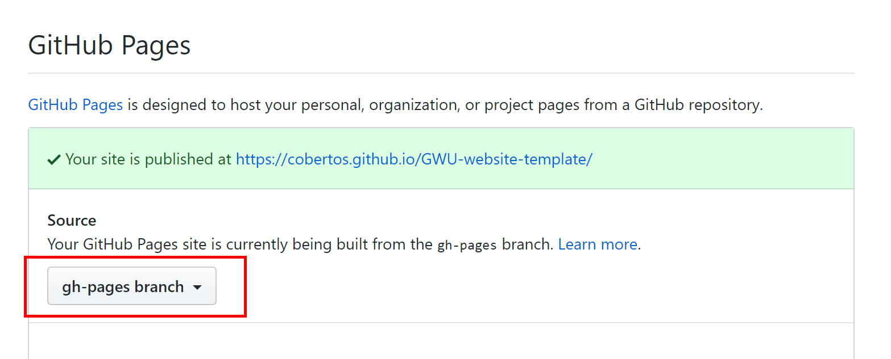

# GWU-website-template

Template for creating your own GWU chapter website using web's best practices, all editable and deployable from GitHub. View the live demo: https://cobertos.github.io/GWU-website-template

## Basic Installation

By the end of these instructions you'll have a live, deployed copy of the template

#### 1. Fork this repository
[ this repository](https://github.com/Cobertos/GWU-website-template/fork), which will make a clone into your own account.

#### 2. Make your repository a website
To make your repository a website, you need to change some GitHub settings.

1. Go to the **Settings** tab
2. Scroll to the **GitHub Pages** heading
3. Set the **source** option to `gh-pages branch`.

#### 3. Configure GitHub Actions secrets
Before this template can automatically builds and deploy your site, you need to configure the GitHub Action that does that.

1. [Create a GitHub Personal Access Token (PAT)](https://help.github.com/en/github/authenticating-to-github/creating-a-personal-access-token-for-the-command-line#creating-a-token) using the linked instructions.
2. Go to the **Settings** tab
3. Go to the **Secrets** sub tab
4. Add a secret named `GH_PAT` and the value should be your token from step 1.

#### 4. Edit the repository content
You can edit the content of the template from the **Code** tab. You can replace any file (like logos) with a new one of the same name and size. You can also edit any copy on the pages in the [`pages/`](https://github.com/Cobertos/GWU-website-template/tree/master/pages) folder in your repository.

After making any changes that are then committed to the repository, the site will automatically rebuild and deploy to your live site. You can check on the progress of a build in the **Actions** tab

Once your first build finishes successfully, your site should now be live! You should be able to find it at `[username].github.io/GWU-website-template`. You can rename your repository to change the URL from `GWU-website-template` or add a custom URL from the **Settings** menu.

Now that your site is live and you can edit it, I **highly recommend** setting up a Content Delivery Network (CDN) in front of your website to speed it up. Personally, I use [Cloudflare](https://cloudflare.com) because it's free for entry level users. It really does a lot for the speed of your site.

## Advanced Configuration

If you don't want to host your website on GitHub, you'll need to change the `gh-pages` action in `.github/workflows/proddeploy.yml` to something for your service. For Amazon S3, that might be something like [`s3-sync-action`](https://github.com/jakejarvis/s3-sync-action) or you might even delete the `gh-pages` action and use a service like [`Netlify`](https://www.netlify.com/). There are many alternatives.

If you have any questions, feel free to [make an issue](https://github.com/Cobertos/GWU-website-template/issues/new?labels=question)

## Bugs

The template is meant to support IE11, Edge, Firefox, Chrome, and Safari. If you have a bug please [submit a report](https://github.com/Cobertos/GWU-website-template/issues/new?labels=bug).

## Contributing

For detailed technical information and how to contribute, take a look at [`CONTRIBUTING.MD`](CONTRIBUTING.MD)
